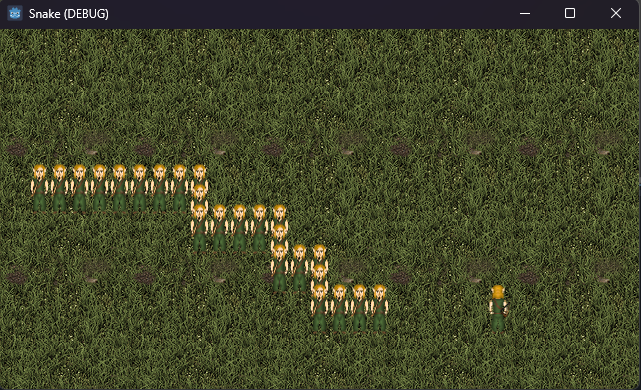

# Juego de la Serpiente

Este es un simple juego de la serpiente hecho en Godot.

## Descripción

El objetivo del juego es mover el elfo para capturar los elfos de espalda y estos comenzaran a seguirte.

## Instrucciones

- Usa WASD para moverte.
- Captura elfos de espalda para hacer la fila mas larga.

## Imagen del Juego

